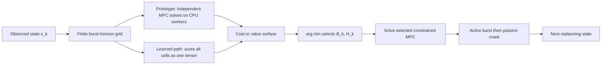

# Burst-Coast MPC: Toward Max-Coast Spacecraft Control

*Initial advisor presentation: idea, formulation, benchmark progress, and research choices*

---

## 1. Motivation and long-term research goal

Spacecraft navigation and control are natural settings for **coast-dominant control**:

- natural orbital or attitude dynamics can provide useful motion without continuous actuation;
- propellant, actuator cycles, onboard power, and processor time are limited;
- long nonlinear prediction horizons help decision quality but make conventional MPC expensive;
- safety-critical autonomy should expose why it actuates, coasts, or replans.

The long-term goal is a **max-coast controller** that exploits natural dynamics and wakes the optimizer only when useful. A representative objective is

$$
\min_{\pi}\;
J_{\mathrm{task}}
+w_a\sum_t \mathbf 1_{\{\lVert u_t\rVert>\varepsilon_u\}}
+w_e\sum_t \lVert u_t\rVert^2
+w_c\sum_k t_{\mathrm{solve},k},
$$

or equivalently maximize coast time subject to

$$
x_t\in\mathcal X_{\mathrm{safe}},
\qquad u_t\in\mathcal U,
\qquad \Diamond\mathcal G,
\qquad \Box\mathcal X_{\mathrm{safe}}.
$$

$\Diamond\mathcal G$ is the liveness objective of eventually reaching the goal; $\Box\mathcal X_{\mathrm{safe}}$ is continued safety. These are future research guarantees, not claims of the present benchmark.

The explainable division of responsibility is: a strategic layer chooses **how long to actuate and when to replan**, while constrained MPC computes the physical commands. A neural policy never commands the plant directly.

**Suggested motivation figure:** a spacecraft path drawn as long blue coast arcs separated by short orange thrust arcs, with "optimizer awake" windows above the thrust arcs and callouts for propellant, computation, safety, and arrival.

---

## 2. General formulation and fast grid computation

For a constrained nonlinear system,

$$
\dot x=f(x,u),
\qquad x_{i+1}=F_{\Delta t}(x_i,u_i),
\qquad x_i\in\mathcal X,
\quad u_i\in\mathcal U.
$$

At replanning epoch $k$, choose a timing action

$$
a_k=(B_k,H_k)\in\mathcal A,
\qquad 1\le B_k\le H_k,
\qquad
u_{i\mid k}=
\begin{cases}
v_{i\mid k}, & i<B_k,\\
u_{\mathrm{coast}}, & B_k\le i<H_k.
\end{cases}
$$

$B_k$ is the active burst, $H_k$ is the prediction or next-replanning horizon, and $u_{\mathrm{coast}}$ is prescribed, commonly as zero input. For each candidate,

$$
J_{\mathrm{MPC}}^*(x_k;a_k)
=\min_{v_{0:B_k-1}}
\left[
\sum_{i=0}^{B_k-1}\ell_b(x_{i\mid k},v_{i\mid k},\Delta v_{i\mid k})
+\sum_{i=B_k}^{H_k-1}\ell_c(x_{i\mid k},u_{\mathrm{coast}})
+V_f(x_{H_k\mid k})
\right]
$$

subject to the model, constraints, and burst-coast structure.

The strategic segment cost includes physical and computational consequences,

$$
c_k=w_t\tau_k+w_u\sum_{i\in k}\rho(u_i)
+w_c\frac{t_{\mathrm{solve},k}}{\Delta t}
+P_f\mathbf 1_{\{\mathrm{terminal\ failure}\}},
\qquad r_k=-c_k,
$$

and the scheduling critic follows Bellman's optimality equation,

$$
Q^*(s_k,a_k)=\mathbb E\!\left[c_k+
\mathbf 1_{\{\neg d_k\}}\min_{a'\in\mathcal A}Q^*(s_{k+1},a')\right],
\qquad
a_k^*=\arg\min_{a\in\mathcal A}\widehat Q(s_k,a).
$$

MPC then solves only the selected $(B_k,H_k)$ physical-control problem.

**Progress.** The early controller enumerated split/horizon variants outside the nonlinear program, giving independent fixed-size problems that were process-parallelized. The current inner baseline is serial so solve-time labels are meaningful; Monte Carlo episodes still run in parallel processes. Learned deployment already broadcasts the state across the complete action grid for batched tensor evaluation.

**Acceleration path:**

1. Linearize about a nominal trajectory, $\delta x_{i+1}=A_i\delta x_i+B_i\delta u_i$, and batch local QP/SQP problems.
2. Reuse suffix values with $V_j(x)=\min_a\{c(x,a)+V_{j+1}(F(x,a))\}$, allowing replanning before the nominal horizon.
3. Move state/action rollouts and value evaluation into GPU tensors so the candidate dimension is parallel.

**Recommended computation figure:** two $(B,H)$ heat maps. The left shows one CPU solve and solve time per cell; the right shows one GPU tensor evaluation, the minimum cell, and its burst/coast timeline.

---

## 3. First benchmark: torque-limited inverted pendulum

Weak actuation makes the pendulum a useful nonlinear benchmark: it must exploit phase, energy accumulation, and coasting rather than move directly to the upright equilibrium.

With $x=[\theta,\omega]^T$, $\theta=0$ upright, and $I=m\ell^2$,

$$
\dot\theta=\omega,
\qquad I\dot\omega=mg\ell\sin\theta-b\omega+u.
$$

The mechanical energy, target energy, and normalized error are

$$
E(\theta,\omega)=\frac12 I\omega^2+mg\ell(1+\cos\theta),
\qquad E^*=2mg\ell,
\qquad e_E(x)=\frac{E(x)-E^*}{E^*}.
$$

Prediction uses a fixed-step RK4 map. With natural period $T_n$,

$$
H_k=\max\!\left(1,\left\lceil\frac{\bar H_kT_n}{\Delta t}\right\rceil\right),
\quad
B_k=\max\!\left(1,\operatorname{round}(\bar B_kH_k)\right),
\quad C_k=H_k-B_k.
$$

The current inner MPC cost is

$$
J_{\mathrm{MPC}}
=\sum_{i=0}^{H_k-1}q_Ee_E(x_{i\mid k})^2
+\sum_{i=0}^{B_k-1}q_{\Delta u}
\left(\frac{u_{i\mid k}-u_{i-1\mid k}}{u_{\max}}\right)^2.
$$

Phase and local-upright features are logged and visualized but are not weighted in this baseline. The replanning-level cost and reward are

$$
c_k=w_t(t_{k+1}-t_k)
+w_u\sum_{i=t_k}^{t_{k+1}-1}\left(\frac{u_i}{u_{\max}}\right)^2
+w_c\frac{t_{\mathrm{solve},k}}{\Delta t}
+P_f\mathbf 1_{\{\mathrm{terminal\ failure}\}},
\qquad r_k=-c_k.
$$

The enforced input and coast constraints are

$$
|u_{i\mid k}|\le u_{\max}<mg\ell,
\qquad u_{i\mid k}=0\ \text{for}\ B_k\le i<H_k.
$$

The reported operating and goal sets are

$$
\mathcal X=\{(\theta,\omega):|\theta|\le\theta_{\max},\ |\omega|\le\omega_{\max}\},
\qquad
\mathcal G=\{(\theta,\omega):|\operatorname{wrap}(\theta)|\le\varepsilon_\theta,
\ |\omega|\le\varepsilon_\omega\}.
$$

The goal must hold for consecutive samples. The state limits are currently monitored diagnostics, not hard MPC constraints; hard safety enforcement remains future work.

*Recorded replay of the actual real-time layout: kinetic and potential energy, phase, action, and pendulum animation. This goal-reaching run is benchmark evidence, not a safety certificate.*

*A standard per-run artifact: sampled $(\bar B,\bar H)$ actions, segment timing, solve time, immediate cost, and backward return cost.*

---

## 4. Failed training, recovery plan, and next research choice

The previous critic fit logged Monte Carlo returns, but its greedy closed-loop policy later collapsed toward minimum horizons and nearly zero actuation. Exploratory episodes often reached the goal, so exploration masked deterministic policy failure.

The preserved artifacts point to coupled causes:

- action semantics and the horizon range changed after offline training;
- random-continuation returns estimate $Q^\mu$, not deployed $Q^*$;
- learned physical weights changed the intended time/effort/compute objective;
- training and deployment used inconsistent compute-cost estimates;
- episode-local replay caused forgetting, while a raw grid minimum exploited unsupported actions;
- one initial state and no locked greedy validation gate allowed collapse to pass.

### Current recovery plan

1. Reconstruct a complete Markov state, including remaining episode time and unwrapped-state information.
2. Calibrate solver time under single-worker conditions and recompute the fixed immediate cost without altering raw data.
3. Pretrain only an initialization on recalculated behavior-policy returns.
4. Train twin conservative cost critics with target networks,
   $$
   Q_C^-(s,a)=\max(Q_1^-(s,a),Q_2^-(s,a)),
   \qquad
   y=c_{\mathrm{calibrated}}+(1-d)\min_{a'}Q_C^-(s',a'),
   $$
   so unsupported actions cannot appear artificially cheap.
5. Add common-state action branches and policy-directed trajectories while retaining all earlier training data.
6. Select only by deterministic multi-state validation, then freeze the method before opening the test set.

### Near-future choices

**Recommended immediate direction:** finish the trustworthy $Q$ critic, then use its value sequence to choose an **early replanning schedule by dynamic programming**. This most directly tests the max-coast hypothesis with the existing pipeline.

Other directions for advisor selection:

- **Theory:** explainable neural control-Lyapunov/barrier functions for progress, liveness, and safety.
- **Faster nonlinear MPC:** terminal cost, cost smoothing, and warm starts.
- **Adaptive discretization:** dynamic $\Delta t$ for MPC and comparison with MPPI.
- **Reduced-order support:** energy-phase representations for coast progress and lower-dimensional reasoning.
- **Broader use:** the same outer RL scorer plus inner MPC as a learned selector for general non-convex problem variants.

**Supplementary figures to make next:** greedy-vs-exploratory horizon collapse; an energy-phase portrait colored by selected coast duration and safe set; and a value-along-coast curve marking the dynamic-programming early-replan point.

### Questions for the advisor

- Is the primary claim actuation economy, computation economy, or a constrained trade-off?
- Should the next milestone prioritize a deployable critic or a formal CLF/CBF argument?
- Which spacecraft dynamics should follow the pendulum: attitude, relative orbital motion, or low-thrust transfer?
